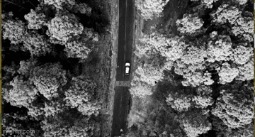

# ZenoTrack

**Fast ZNCC-based multi-target object tracker in C** — decoding via FFmpeg, grayscale via libswscale, and rendering with SDL2.  
Drag a rectangle over the video to add one or more targets and watch the tracker follow them in real-time.

---

## Features
- **Multi-target** tracking with interactive ROI selection (mouse drag)
- **ZNCC** with **integral images** for fast patch normalization
- **Coarse-to-fine** search + **1D quadratic sub‑pixel** peak refinement
- **Adaptive search window** based on motion/velocity and confidence (PSR/ρ)
- **Conservative online template update** to mitigate drift
- Lightweight profiling (exposed via `tracker_get_timing`)

Core implementation lives in `src/second.c`. Public types and API are defined in `include/second.h`. The demo app is `src/main.c`. fileciteturn0file0turn0file1turn0file2

---

## Quick start

### Build
```bash
cmake -S . -B build
cmake --build build -j
```

### Run
```bash
./build/zenotrack path/to/video.mp4
```

### Controls
- **Left mouse drag**: add target (ROI)
- **Right click**: clear all targets
- **`c`**: clear target list
- **`q`**: quit

The demo reads the video path from the command line (see `main.c`). fileciteturn0file2

---

## Dependencies
- FFmpeg: `libavformat`, `libavcodec`, `libswscale`, `libavutil`
- SDL2
- CMake ≥ 3.16 and a C11 compiler

### Install quickly
**Ubuntu/Debian**
```bash
sudo apt update
sudo apt install -y build-essential cmake pkg-config libsdl2-dev   libavcodec-dev libavformat-dev libswscale-dev libavutil-dev ffmpeg
```

**macOS (Homebrew)**
```bash
brew install cmake ffmpeg sdl2 pkg-config
```

**Windows (vcpkg)**
```powershell
vcpkg install sdl2 ffmpeg[core,avcodec,avformat,swscale,avutil]:x64-windows
cmake -S . -B build -DCMAKE_TOOLCHAIN_FILE=C:/path/to/vcpkg.cmake
cmake --build build -j
```

---

## Project structure
```
.
├── CMakeLists.txt
├── README.md
├── LICENSE
├── assets/
│   └── (demo.mp4, demo.gif)
├── include/
│   └── second.h
└── src/
    ├── main.c
    └── second.c
```

- `src/second.c`: integral images, ZNCC evaluation, sub‑pixel refinement, model update, SDL rendering. fileciteturn0file0  
- `include/second.h`: public API and data structures. fileciteturn0file1  
- `src/main.c`: minimal FFmpeg decode loop feeding the tracker. fileciteturn0file2

---

## Record a demo (video/GIF) for the README

1) **Easiest**: record the app window with OBS and save to `assets/demo.mp4`.

2) **FFmpeg** examples:

- **Linux (X11, full screen):**
  ```bash
  ffmpeg -f x11grab -framerate 30 -i :0.0 -video_size 1280x720          -c:v libx264 -preset veryfast -crf 23 -y assets/demo.mp4
  ```

- **Windows (gdigrab, desktop):**
  ```powershell
  ffmpeg -f gdigrab -framerate 30 -i desktop -video_size 1280x720          -c:v libx264 -preset veryfast -crf 23 -y assets/demo.mp4
  ```

- **macOS (AVFoundation):**
  ```bash
  ffmpeg -f avfoundation -framerate 30 -i "1" -video_size 1280x720          -c:v libx264 -preset veryfast -crf 23 -y assets/demo.mp4
  ```

3) **Convert to a high‑quality GIF** (for embedding in README):
```bash
ffmpeg -i assets/demo.mp4 -vf "fps=30,scale=960:-1:flags=lanczos,palettegen" -y assets/palette.png
ffmpeg -i assets/demo.mp4 -i assets/palette.png -lavfi "fps=15,scale=960:-1:flags=lanczos,paletteuse" -y assets/demo.gif
```

Then reference it in the README:
```markdown

```

---

## Optimization notes
- Integral images are computed with an extra top row and left column of zeros (1‑based), minimizing initialization and enabling O(1) rectangular sums. fileciteturn0file0
- The inner ZNCC loop is branch‑free to help autovectorization. fileciteturn0file0
- Sub‑pixel refinement uses a simple 1D quadratic fit over three samples per axis. fileciteturn0file0

---

## License
MIT — see `LICENSE`.
